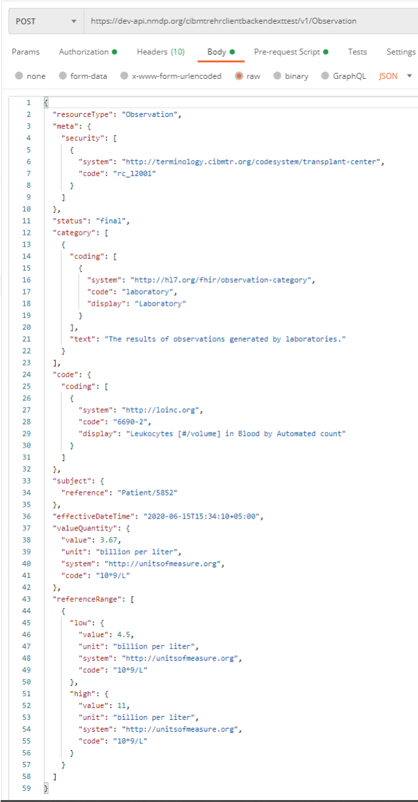

# Direct FHIR STU 3 - CIBMTR Reporting Implementation Guide v0.1.11

* [**Table of Contents**](toc.md)
* **Direct FHIR STU 3**

## Direct FHIR STU 3

### Using the CIBMTR Direct FHIR API

 Note: While this IG is focused on FHIR R4, the current Direct FHIR API only supports FHIR STU3 reources. This document describes how to submit FHIR data electronically using available CIBMTR REST APIs. Data for each patient is submitted using the HL7 FHIR exchange protocol in JSON or XML format. The REST APIs are available for integration into a custom client architecture or for submission using a manual client such as Postman. 

#### Conformance to the US Core Implementation Guide

In general, FHIR resources should conform to the US Core Implementation Guide and associated profiles. The Patient FHIR resource is a special exception in that CIBMTR removes any Personally Identifiable Information (PII) from the Patient resource. The Direct FHIR Service API can accept multiple different FHIR resource types, however, only lab data for form 2402 is implemented to fully prepopulate questions on a form. Submitting lab data for form 2402 only requires implementation of the Observation FHIR resource. Additional data types and form questions will be supported in CY ’21.

#### Process for submitting data

The process for submitting production data to CIBMTR includes three sequential steps:

1. Request CIBMTR Direct FHIR Service API Access Credentials
1. Submit test data using the CIBMTR test API endpoint URLs
1. Submit production data with the CIBMTR production API endpoint URLs

Once electronic data has been submitted via the Direct FHIR Service API, the Data Manager can login to the FormsNet interface to complete the form. Within the form, there will be clarifying contextual questions that provide important information for associating the dates of the labs with the key dates of interest on the form. 

#### Access Credentials

The CIBMTR relationship manager or technical lead can initiate a request for API credentials. CIBMTR uses OAuth2.0/OpenID (OIDC) for authentication and access management. This process involves making a request to a third-party authorization server to receive a token. The token is then passed to the CIBMTR API URL in the request header. The following information will be provided by CIBMTR and is necessary for requesting an authorization token:

* CIBMTR Service Account Username
* CIBMTR Service Account Password
* Application Client ID
* Application Client Secret
* Application Scope

Different sets of credentials will be provided for the CIBMTR test and production environments.

To request an authentication token for the test environment, the third-party authorization server URL is: 

`POST https://nmdp.oktapreview.com/oauth2/ausaexcazhLhxKnJs0h7/v1/token `

or:

`POST https://nmdp.oktapreview.com/oauth2/aus3ck6q30qmOdpMb1t7/v1/token `

To request an authentication token for the production environment, the third-party authorization server URL is:

` POST https://nmdp.okta.com/oauth2/ausaexcazhLhxKnJs0h7/v1/token `

or:

`POST https://nmdp.okta.com/oauth2/aus3ck6q30qmOdpMb1t7/v1/token `

The header of the POST request to the authorization server must have an authorization string. The string is constructed by base64 encoding the Application Client ID, a colon, and the Application Client Secret. The encoded string is then appended to the word “Basic ”. 

` const auth_string = "Basic " + base64("<Application Client ID>" + ":" + "<Application Client Secret>") `
An example of the header parameters for the POST request to the authorization server is shown in Figure 1. In the figure, the authorization string is blacked out. Notice the space between the base 64 encoded string and the string prefix, “Basic”.

"FIGURE1" Figure 1: Example header information for the POST request to the authorization server Figure 2 shows the required fields in the body of the POST request to the authorization server API. 

The value for the “username” key should be the CIBMTR Service Account Username provided by CIBMTR. The value for the “password” key should be the CIBMTR Service Account Password. The “grant_type” key and the “scope” key should have the same values as shown in Figure 2. The response to the POST request will return a JSON object that includes a base64 encoded token. The token can be a long character string (over 1000 chars).

"FIGURE2" Figure 2: Example body of the POST request to the authorization server API

Once the token has been received, a request to the CIBMTR Direct FHIR Service API can be made. Tokens are valid for 30 minutes in the production environment, but last up to 24 hours in the test environment. [b]Applications must cache and re-use tokens until they are about to expire because Okta rate limits requests for new tokens. One workable strategy is to obtain a new token every 25 minutes.

To make a request to the CIBMTR Direct FHIR Backend API, include the token in the header as the authorization key value of the request along with the word “Bearer ” in front of it, as shown in shown in Figure 3.

"FIGURE3" Figure 3: Example CIBMTR Direct FHIR API request using a bearer authorization token in the header of the request 

#### Recommended Data Submission Workflow

Submitting data to CIBMTR via the Direct FHIR Service API involves a three-step process for each patient:

##### Step 1: Register patient and receive CRID

Register a patient with CIBMTR and receive a CIBMTR Recipient Identifier (CRID) to use as a patient reference for all subsequent FHIR data submissions. CIBMTR exposes a special service API to handle the submission of personally identifiable information (PII). Data submitted via the CRID Service API has special protections and exposure within CIBMTR to avoid unnecessary handling of PII. For all subsequent FHIR data submissions, the CRID is used to identify the patient and any PII is removed from FHIR resources before being stored on CIBMTR FHIR servers.

The CRID Service API uses a PUT request at the following case-sensitive endpoint URLs: Test Environment:

` PUT https://dev-api.nmdp.org/cibmtrehrclientbackendexttest/v1/CRID `
Production Environment:

` PUT https://api.nmdp.org/cibmtrehrclientbackend/v1/CRID `
The authorization key and bearer token must be included in the request as mentioned in the previous section. For the body of the PUT request, the following data fields are requested:

Five required attributes

* CCN (5digit)
* First and last name
* Birthdate (YYYY-MM-DD)
* Gender (M/F)
Optional attributes (possibly present)
* SSN (###-###-####)
* Mother’s maiden name
* Race (race code)
* Ethnicity (ethnicity code)
* NMDP RID
* EBMT CIC + ID
* CIBMTR Team + IUBMID

Complete list of payload options for CRID registration

```
 
    { "ccn": "string", 
      "patient": { 
          "birthDate": "string", 
          "cibmtrIubmid": "string",
          "cibmtrTeam": 0, 
          "ebmtCic": "string", 
          "ebmtId": "string", 
          "firstName": "string", 
          "gender": "string", 
          "lastName": "string", 
          "mothersMaidenName": "string", 
          "nmdpRid": 0, 
          "ssn": "string", 
          "race": ["string"], 
          "ethnicity": "string" 
        } 
    }
    
```

###### Race Codes

* Race Value Code: 1002-5
  * Description: American Indian or Alaska Native
* Race Value Code: 2028-9
  * Description: Asian
* Race Value Code: 2054-5
  * Description: Black or African American
* Race Value Code: 2076-8
  * Description: Native Hawaiian or Other Pacific Islander
* Race Value Code: 2106-3
  * Description: White
* Race Value Code: ASKU
  * Description: Not Reported
* Race Value Code: UNK
  * Description: Unknown

###### Ethnicity Codes

* Ethnicity Value Code: 2135-2
  * Description: Hispanic or Latino
* Ethnicity Value Code: 2186-5
  * Description: Non Hispanic or Latino
* Ethnicity Value Code: UNK
  * Description: Unknown

The CRID Service API is available as a PUT request. Consequently, submitting the same data twice does not re-register the patient, but rather will retrieve the same CRID number registered previously. The CRID Service API will attempt to perform partial “fuzzy” matches based on data submitted to avoid re-registering the same patient with two different CRID numbers.

The response payload of the CRID Service API is a JSON object that contains the CRID number (lower pane in Figure 4). The CRID number is then used for all other data references to the registered patient.

"FIGURE4"

##### Step 2: Submit Patient FHIR Resource

The Patient FHIR resource must be submitted before any other FHIR resources3. the Patient FHIR resource ID is part of the response to the Patient POST request. The resource ID is unique to the 3 http://hl7.org/fhir/STU3/patient.html

Figure 4: Example CRID registration PUT request with JSON body payload (top pane) and response payload (bottom pane)

CIBMTR FHIR server and is used to reference the Patient subject on all subsequently submitted FHIR resources. The resource ID is assigned by the FHIR server and is different from the Patient.identifier section of the FHIR resource. The Direct FHIR Service API uses a POST request to submit a Patient resource at the following case-sensitive endpoint URLs:

| | |
| :--- | :--- |
| Test Environment | `POST https://dev-api.nmdp.org/cibmtrehrclientbackendexttest/v1/Patient` |
| Production Environment | `POST https://api.nmdp.org/cibmtrehrclientbackend/v1/Patient` |

The authorization key and bearer token must be included in the request as mentioned in the previous section. FHIR JSON submissions should also include a “content-type” key in the header with value: “application/fhir+json”. The Patient FHIR resource usually contains the demographics data for the patient, however, since the demographics data is already submitted during the CRID registration process, there are only two primary components necessary in the Patient FHIR resource: 

1. A security label within the “meta” section of the Patient resource must contain the CIBMTR Center Number (CCN) prepended with “rc_” and associated with the codesystem as shown in Figure 5.
1. A CRID identifier reference within the “identifier” section of the Patient resource as shown in Figure 5.

PII information should be avoided as part of the Patient resource. However, the Direct FHIR Service API will remove PII information, including any that might be contained in “text” or other sections of the resource before storing it on the FHIR server. The response after submitting a Patient resource request, indicates how the Patient resource is represented on the CIBMTR FHIR server (see Figure 6). The response JSON object has an “id” that is used to reference the Patient resource (circled in red in Figure 6). There is a new security label that indicates that the resource has been through a redaction process to remove any PII that may have been submitted with the Patient resource.

` GET https://dev-api.nmdp.org/cibmtrehrclientbackendexttest/v1/Patient? _security=http://terminology.cibmtr.org/codesystem/transplant-center%7Crc_<CCN>& identifier=<CRID> `

 The Patient resource ID is necessary for submitting other FHIR resources to the Direct FHIR Service API, but if the ID for a Patient resource previously submitted is not known, the following GET request can be submitted to the API to retrieve the Patient resource for a given CRID: 

Where the <CCN> should be replaced with the associated CCN and the <CRID> replaced with the CRID number.

Figure 5: Example POST request to submit a Patient FHIR resource and the required FHIR sections in the body of the request

Figure 6: Example FHIR Patient submission response with the Patient resource ID assigned by the FHIR server 

#####  Step 3: Submit Observation FHIR Resources 
The Direct FHIR Service API uses a POST request to submit an Observation resource at the following case-sensitive endpoint URLs4: Test Environment Production Environment

| | |
| :--- | :--- |
| Test Environment | `POST https://dev-api.nmdp.org/cibmtrehrclientbackendexttest/v1/Observation` |
| Production Environment | `POST https://api.nmdp.org/cibmtrehrclientbackend/v1/Observation` |

The authorization key and bearer token must be included in the request as mentioned in the previous section. FHIR JSON submissions should also include a “content-type” key in the header with value: “application/fhir+json”.

 CIBMTR is continually expanding support for data types to pre-populate CIBMTR forms. Currently, laboratory values for form 2402 are supported. Laboratory data required to answer the questions on form 2402 are communicated using the Observation FHIR resource. 

Figure 7: Table of labs currently supported by the CIBMTR for form prepopulation 

An example of an Observation FHIR resource is shown in Figure 8. The basic structure of this FHIR resource is the same for all the different types of labs. Important areas to note:

*  “meta” Section – This is the metadata section of the resource and includes the same security label as defined in the Patient resource. This security label is required and should include the center specific CCN. 
*  “category” Section – This section uses the HL7 Observation category code to enable category-based searches. Currently, only data from the “laboratory” category is supported. This section is optional.
*  “code” Section – The clinical concept code for the type of laboratory is included in this section. For laboratory data, the primary clinical vocabulary is LOINC5. LOINC codes can have different specific applied concepts depending on a variety of lab parameters such as: collection method, measurement method, sub-types, and naming conventions. A list of candidate LOINC codes for each of the supported lab types is included Figure 7. This list is not comprehensive and choosing the correct code can require clinical interpretation, therefore, data managers are encouraged to get clinician review of the selected LOINC code. This section is required. 
*  “subject” Section – Each Observation resource must reference the patient associated with the lab values. The subject.reference allows the Observation resource to point to the Patient using the Patient resource “id” using the “Patient/id” format. This section is required. 
* “effectiveDateTime” – This is a timezone aware datetime format of the date of collection of the lab sample. This section is required. 
*  “valueQuantity” – The actual value of the measured lab is represented here as a floating-point number. The unit system and code are also specified. The list of preferred units is shown in Figure 7, however the CIBMTR data translation engine will convert the units after submission if necessary. The units system and code should be UCUM. This section is required. 
*  referenceRange” – If the high and low range for this lab are known, they can be defined in this section using the same data format as the valueQuantity section. This section is optional. 

To search for all Observation resources on the CIBMTR FHIR server for a given CRID, see the below GET request API URL:

`GET https://dev-api.nmdp.org/cibmtrehrclientbackendexttest/v1/Observation?subject:Patient.identifier=<CRID>`
 

Figure 8: Example POST request for submitting an Observation resource, including the Observation resource format in the body of the request

####  Submitting CRID/FHIR Data Using the Postman Client 

The example API calls in this document are taken from the Postman API client. Postman allows a user to manually configure and test connecting to and interacting with different APIs. Using Postman is a great way to understand an API, see the responses, and submit limited data manually. Once the API is well understood, then a custom client can be implemented programmatically using any number of REST client libraries.

 Postman includes the concept of a collection of requests. A collection file can be imported into Postman. CIBMTR has a collection of requests that accomplish all the tasks in this user guide. The collection is available upon request. 

Figure 9: Example POSTMAN collection of requests available from CIBMTR

 Postman also includes the option to run a pre-request script before making an API request. The CIBMTR collection includes a pre-request script that can get the authentication token automatically each time a request is made. These and other simplifications of the process make Postman an excellent tool for exploring, developing, and using the CIBMTR Direct FHIR Service APIs for submitting patient data. 

 NOTE: Requesting a new token for manual requests should not cause Okta to rate-limit these requests. However, automated systems must cache and re-use the authentication token to avoid errors. Tokens are valid for 30 minutes in the production environment. 

####  Frequently Asked Questions 

